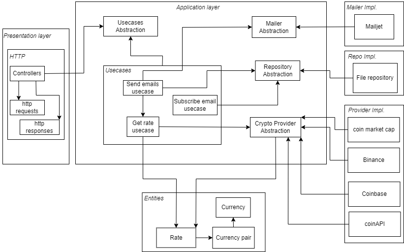

# Crypto Rate Application

## Features
- Get BTCUAH rate (can be easily extended to any requested pair due to clean arch)
- Using multiple crypto providers in the chain of responsibility pattern (if any provider will fail the next one will be used)
- Using in-memory caching of rate response 
- Subscribe emails for a sending list
- Send current rate to all the subscribers

## Possible Improvements
- Use redis instead of in-memory cache
- Replace file storage db with e.g. mongo

## How to run
- Create .env file with your api keys (use .env_sample as an example)
- docker-compose build
- docker-compose up

## Run linter
- install golangci-lint
-  ```shell
    golangci-lint run
   ```

## Architecture of the project


### Written using Uncle Bob's clean arch principles:
- Such systems are easy to expand
- It is more convenient to test
- It is easy to change external dependencies
- etc.

### Diagram:



## Used Crypto providers
- Coinmarketcap api
- Binance
- Coinbase
- CoinAPI

## Mailers
- Mailjet
- will be replaced with SendPulse
